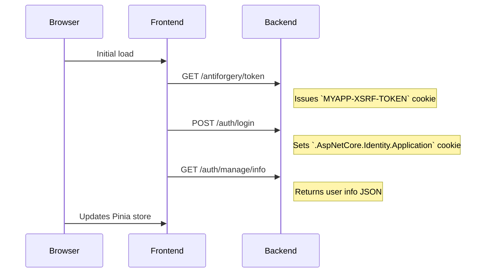

# Integration Plan: Vue.js Frontend <-> ASP.NET Core Backend (Cookie-Based Auth)

## Overview



## Step 1: Install & Configure Axios

1. Install:

   ```bash
   cd frontend/thrume-frontend
   pnpm add axios
   ```

2. Create an Axios instance at [`src/services/api.ts`](frontend/thrume-frontend/src/services/api.ts:1):

   ```js
   import axios from 'axios';
   
   const apiClient = axios.create({
     baseURL: 'https://localhost:5133',
     withCredentials: true
   });
   
   // Request interceptor for CSRF and tokens
   apiClient.interceptors.request.use(...);
   
   // Response interceptor for 401 handling
   apiClient.interceptors.response.use(...);
   
   export default apiClient;
   ```

## Step 2: Update Vite Config for HTTPS & Proxy

Edit [`vite.config.ts`](frontend/thrume-frontend/vite.config.ts:1):

```ts
export default defineConfig({
  server: {
    https: true,
    proxy: {
      '/auth': {
        target: 'https://localhost:5133',
        changeOrigin: true,
        secure: false
      },
      '/posts': {
        target: 'https://localhost:5133',
        changeOrigin: true,
        secure: false
      },
      '/antiforgery': {
        target: 'https://localhost:5133',
        changeOrigin: true,
        secure: false
      }
    }
  },
  // ...existing plugins & alias...
})
```

## Step 3: Refactor Service Modules to Use `apiClient`

- **Auth**: Update [`src/services/authApi.ts`](frontend/thrume-frontend/src/services/authApi.ts:1) to use `apiClient.post('/auth/login', ...)`, `apiClient.post('/auth/register', ...)` and `apiClient.get('/antiforgery/token')`.  
- **Posts**: Update [`src/services/postApi.ts`](frontend/thrume-frontend/src/services/postApi.ts:1) to use `apiClient.get('/posts/:username')`, `apiClient.post('/posts', ...)`, `apiClient.put('/posts/like', ...)`.

## Step 4: Pinia Store Enhancements

In [`src/stores/auth.ts`](frontend/thrume-frontend/src/stores/auth.ts:1):

1. On app startup call `ensureCsrfToken()` then `fetchCurrentUser()`.  
2. Adapt `login()` and `register()` to use Axios and call `fetchCurrentUser()` after login.  
3. Implement `logout()` via `apiClient.post('/auth/logout')`.  
4. Expose `initializeAuth()` and invoke from [`src/main.ts`](frontend/thrume-frontend/src/main.ts:1).

## Step 5: Router Guards

Update [`src/router/index.ts`](frontend/thrume-frontend/src/router/index.ts:1):

- In `router.beforeEach`, await `authStore.initializeAuth()`.  
- Protect routes with `meta.requiresAuth` and redirect on 401.

## Step 6: Backend CORS & HTTPS

- In [`backend/Thrume.Api/Program.cs`](backend/Thrume/Thrume.Api/Program.cs:36), ensure:
  ```csharp
  options.AddPolicy("AllowFrontend", policy =>
      policy.WithOrigins("https://localhost:5173")
            .AllowAnyMethod()
            .AllowAnyHeader()
            .AllowCredentials());
  ```
- Use the `https` profile at `https://localhost:5133` from [`launchSettings.json`](backend/Thrume/Thrume.Api/Properties/launchSettings.json:13).

## Step 7: Development & Testing

1. Trust dev certificates:
   ```bash
   dotnet dev-certs https --trust
   ```
2. Run backend:
   ```bash
   cd backend/Thrume/Thrume.Api && dotnet run --launch-profile https
   ```
3. Run frontend:
   ```bash
   cd frontend/thrume-frontend && pnpm run dev
   ```
4. Verify in browser that cookies and CSRF tokens are exchanged correctly.