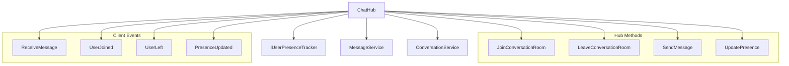
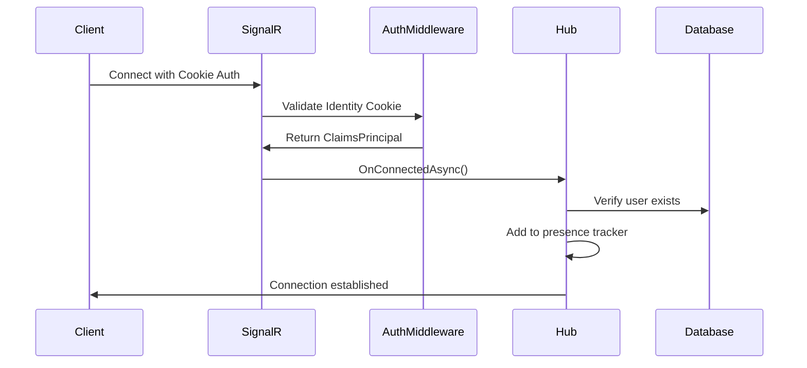
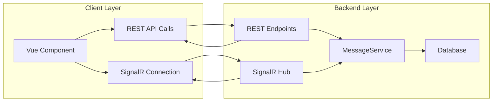
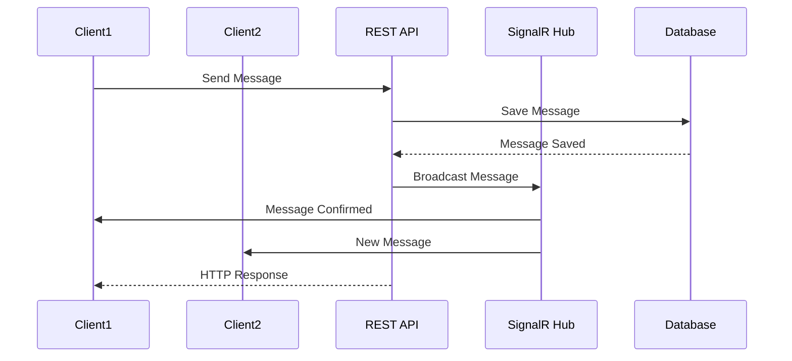
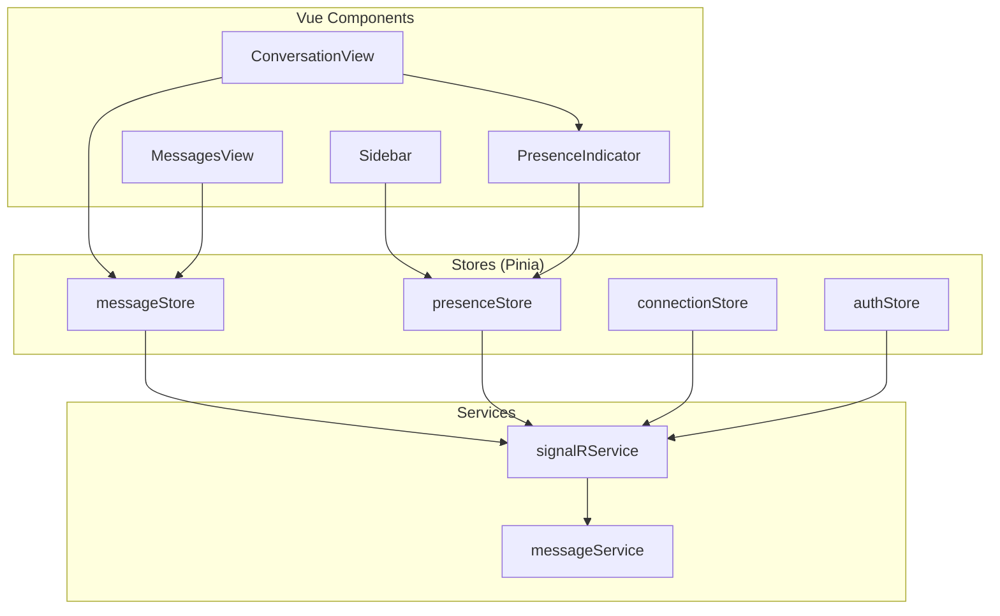
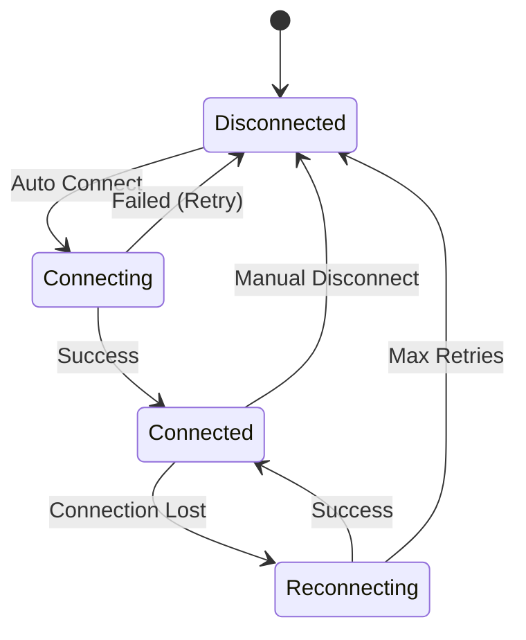

# **Thrume Real-Time Messaging Architecture Plan**

## **1. Current System Analysis**

### **Existing Architecture Strengths:**
- **Robust REST API Foundation**: Well-structured message endpoints with proper authentication
- **Clean Domain Model**: `Message`, `Conversation`, and `Account` entities with proper relationships
- **Service Layer Separation**: `MessageService` provides business logic isolation
- **Identity Integration**: ASP.NET Identity with `AccountId` typed IDs
- **Frontend Optimistic Updates**: `ConversationView` already implements optimistic UI patterns

### **Current Limitations:**
- **No Real-Time Communication**: Messages require manual refresh or polling
- **No Presence Indicators**: Users cannot see who's online
- **Manual State Management**: Frontend manages message state locally without real-time sync

### **Database Schema Assessment:**
The existing schema supports real-time messaging without modifications:
- `MessageConfiguration` includes proper indexing for ConversationId and SentAt
- Many-to-many relationship between `Account` and `Conversation` via Participants collection
- Cascade delete ensures data integrity

### **Current Message Flow:**
```
Client --> REST API --> MessageService --> Database
                    <-- JSON Response <--
```

### **Current Frontend Architecture:**
- **ConversationView**: Handles message display and sending with optimistic updates
- **MessageService**: HTTP client for REST API communication
- **Types**: Well-defined TypeScript interfaces for Message and Conversation entities
- **Pinia Stores**: State management for authentication and account data

---

## **2. SignalR Hub Architecture Design**

### **Core Hub Structure:**



### **Hub Implementation Strategy:**

**Primary Hub: `ChatHub`**
- **Responsibility**: Manage real-time messaging and user presence
- **Groups**: Each conversation becomes a SignalR group
- **Connection Management**: Track user connections per conversation
- **Message Broadcasting**: Distribute messages to conversation participants

**Supporting Service: `IUserPresenceTracker`**
- **Online Users**: Track active connections per user
- **Conversation Presence**: Track which users are in which conversations
- **Presence Broadcasting**: Notify presence changes to relevant users

### **Hub Method Specifications:**

**Server Methods (Called by Client):**
```csharp
public async Task JoinConversationRoom(string conversationId)
public async Task LeaveConversationRoom(string conversationId)
public async Task SendMessage(string conversationId, string content)
public async Task UpdatePresence(bool isOnline)
```

**Client Methods (Called by Server):**
```typescript
ReceiveMessage(message: Message): void
UserJoined(conversationId: string, userId: string): void
UserLeft(conversationId: string, userId: string): void
PresenceUpdated(userId: string, isOnline: boolean): void
```

---

## **3. Authentication & Authorization Strategy**

### **SignalR Authentication Flow:**



### **Authorization Implementation:**
- **Cookie Authentication**: Leverage existing ASP.NET Identity cookies
- **Connection Context**: Access `HttpContext.User` for user identification
- **Group Authorization**: Verify user membership in conversations before joining groups
- **Message Authorization**: Validate sender permissions before broadcasting

### **Security Considerations:**
- **Connection Limits**: Implement per-user connection limits (max 5 connections)
- **Rate Limiting**: Prevent message spam with configurable limits (10 messages/minute)
- **Conversation Validation**: Ensure users can only join authorized conversations
- **CORS Configuration**: Extend existing CORS policy for SignalR
- **Input Validation**: Sanitize all incoming message content

### **Authentication Configuration:**
```csharp
services.AddAuthentication()
    .AddCookie("Identity.Bearer", options => {
        options.Events.OnMessageReceived = context => {
            var accessToken = context.Request.Query["access_token"];
            var path = context.HttpContext.Request.Path;
            if (!string.IsNullOrEmpty(accessToken) && path.StartsWithSegments("/chathub")) {
                context.Token = accessToken;
            }
            return Task.CompletedTask;
        };
    });
```

---

## **4. Data Flow & Consistency Patterns**

### **Hybrid REST + SignalR Pattern:**



### **Message Flow Patterns:**

**1. Sending Messages (Enhanced Flow):**
```
Client --> REST API --> MessageService --> Database
                    --> SignalR Hub --> All Clients in Group
```

**Flow Details:**
1. Client sends message via existing REST API (maintains validation)
2. REST endpoint saves to database via `MessageService.SendMessageAsync`
3. REST endpoint triggers SignalR broadcast to conversation group
4. All connected clients receive real-time message
5. Offline users receive messages when they reconnect via REST API

**2. Receiving Messages:**
- SignalR delivers real-time messages to connected clients
- Offline users receive messages through existing `GetMessagesAsync` pagination
- Message history remains accessible through existing REST endpoints
- Duplicate message handling via message ID deduplication

**3. Presence Updates:**
- Connection/disconnection triggers presence updates
- Presence changes broadcast to users' conversation groups
- No database persistence required for presence data (in-memory tracking)
- Heartbeat system maintains accurate presence state

### **Consistency Guarantees:**
- **Message Ordering**: Database timestamps ensure correct ordering
- **Delivery Guarantee**: REST API ensures message persistence before SignalR broadcast
- **Offline Support**: Existing pagination handles message catch-up
- **Optimistic Updates**: Enhanced with real-time confirmations
- **Idempotency**: Message IDs prevent duplicate processing

### **Data Synchronization Strategy:**


---

## **5. Frontend SignalR Integration Architecture**

### **Vue.js Integration Strategy:**



### **SignalR Service Implementation:**

**Core Service Structure:**
```typescript
class SignalRService {
  private connection: HubConnection | null = null;
  private connectionState = ref<ConnectionState>('Disconnected');
  private retryCount = 0;
  private maxRetries = 5;

  async connect(): Promise<void>
  async disconnect(): Promise<void>
  async joinConversation(conversationId: string): Promise<void>
  async leaveConversation(conversationId: string): Promise<void>
  async sendMessage(conversationId: string, content: string): Promise<void>
  
  // Event listeners
  onMessageReceived(callback: (message: Message) => void): void
  onPresenceUpdated(callback: (userId: string, isOnline: boolean) => void): void
  onUserJoined(callback: (conversationId: string, userId: string) => void): void
  onUserLeft(callback: (conversationId: string, userId: string) => void): void
}
```

**Connection Management:**
- **Singleton Pattern**: Single connection instance across the application
- **Reactive State**: Vue 3 reactivity for connection status
- **Auto-Reconnection**: Exponential backoff strategy for reconnection
- **Cleanup**: Proper connection disposal on app unmount

### **Enhanced Component Architecture:**

**ConversationView Enhancements:**
```typescript
// Remove optimistic updates (replaced by real-time confirmations)
// Add presence indicators for conversation participants
// Handle real-time message reception
// Show connection status indicators

const conversationView = {
  setup() {
    const signalR = useSignalR();
    const messageStore = useMessageStore();
    
    onMounted(async () => {
      await signalR.joinConversation(conversationId.value);
      
      // Listen for real-time messages
      signalR.onMessageReceived((message) => {
        messageStore.addMessage(message);
        scrollToBottom();
      });
    });
    
    onUnmounted(async () => {
      await signalR.leaveConversation(conversationId.value);
    });
  }
};
```

**New PresenceIndicator Component:**
```vue
<template>
  <div class="presence-indicator">
    <div 
      class="status-dot" 
      :class="{ online: isOnline, offline: !isOnline }"
    ></div>
    <span>{{ isOnline ? 'Online' : 'Offline' }}</span>
  </div>
</template>

<script setup lang="ts">
interface Props {
  userId: string;
}

const props = defineProps<Props>();
const presenceStore = usePresenceStore();
const isOnline = computed(() => presenceStore.isUserOnline(props.userId));
</script>
```

### **State Management Pattern:**

**Message Store Enhancement:**
```typescript
export const useMessageStore = defineStore('message', () => {
  const conversations = ref<Conversation[]>([]);
  const messages = ref<Record<string, Message[]>>({});
  const connectionStatus = ref<ConnectionState>('Disconnected');

  // Real-time message handling
  function addMessage(message: Message) {
    const conversationMessages = messages.value[message.conversationId.value] || [];
    
    // Prevent duplicates
    if (!conversationMessages.find(m => m.id.value === message.id.value)) {
      conversationMessages.push(message);
      messages.value[message.conversationId.value] = conversationMessages.sort(
        (a, b) => new Date(a.sentAt).getTime() - new Date(b.sentAt).getTime()
      );
    }
  }

  // Enhanced send message with real-time feedback
  async function sendMessage(conversationId: string, content: string) {
    try {
      // Send via REST API for persistence
      const response = await messageService.sendMessage(conversationId, content);
      
      // SignalR will handle real-time broadcast
      return response;
    } catch (error) {
      // Fallback error handling
      throw new Error('Failed to send message');
    }
  }

  return {
    conversations,
    messages,
    connectionStatus,
    addMessage,
    sendMessage
  };
});
```

**Presence Store:**
```typescript
export const usePresenceStore = defineStore('presence', () => {
  const onlineUsers = ref<Set<string>>(new Set());
  const conversationPresence = ref<Record<string, Set<string>>>({});

  function setUserOnline(userId: string) {
    onlineUsers.value.add(userId);
  }

  function setUserOffline(userId: string) {
    onlineUsers.value.delete(userId);
    // Remove from all conversations
    Object.values(conversationPresence.value).forEach(users => users.delete(userId));
  }

  function isUserOnline(userId: string): boolean {
    return onlineUsers.value.has(userId);
  }

  function getUsersInConversation(conversationId: string): string[] {
    return Array.from(conversationPresence.value[conversationId] || []);
  }

  return {
    onlineUsers: readonly(onlineUsers),
    conversationPresence: readonly(conversationPresence),
    setUserOnline,
    setUserOffline,
    isUserOnline,
    getUsersInConversation
  };
});
```

### **Connection Store:**
```typescript
export const useConnectionStore = defineStore('connection', () => {
  const status = ref<ConnectionState>('Disconnected');
  const lastError = ref<string | null>(null);
  const retryCount = ref(0);

  function setConnectionStatus(newStatus: ConnectionState) {
    status.value = newStatus;
    if (newStatus === 'Connected') {
      lastError.value = null;
      retryCount.value = 0;
    }
  }

  function setConnectionError(error: string) {
    lastError.value = error;
    retryCount.value++;
  }

  return {
    status: readonly(status),
    lastError: readonly(lastError),
    retryCount: readonly(retryCount),
    setConnectionStatus,
    setConnectionError
  };
});
```

---

## **6. Error Handling & Reconnection Strategy**

### **Connection Resilience:**



### **Error Handling Patterns:**

**Connection Errors:**
```typescript
class ReconnectionStrategy {
  private retryDelays = [1000, 2000, 4000, 8000, 16000]; // Exponential backoff
  private maxRetries = 5;
  private currentRetry = 0;

  async attemptReconnection(): Promise<boolean> {
    if (this.currentRetry >= this.maxRetries) {
      return false;
    }

    const delay = this.retryDelays[Math.min(this.currentRetry, this.retryDelays.length - 1)];
    
    await new Promise(resolve => setTimeout(resolve, delay));
    
    try {
      await this.signalRService.connect();
      this.currentRetry = 0;
      return true;
    } catch (error) {
      this.currentRetry++;
      return this.attemptReconnection();
    }
  }
}
```

**Message Delivery Errors:**
- **Retry Mechanism**: Retry failed message sends with REST API fallback
- **Error UI**: Show delivery status indicators (sent, delivered, failed)
- **Queue Management**: Queue messages during connection issues
- **Conflict Resolution**: Handle duplicate messages gracefully

**Presence Errors:**
- **Stale Data Cleanup**: Remove stale presence data after 30-second timeout
- **Heartbeat System**: Periodic connection validation every 15 seconds
- **Recovery Process**: Rebuild presence state on reconnection

### **Error UI Components:**

**Connection Status Indicator:**
```vue
<template>
  <div class="connection-status" :class="statusClass">
    <div class="status-icon"></div>
    <span>{{ statusText }}</span>
    <button v-if="showRetry" @click="retry">Retry</button>
  </div>
</template>

<script setup lang="ts">
const connectionStore = useConnectionStore();
const signalR = useSignalR();

const statusClass = computed(() => ({
  'status-connected': connectionStore.status === 'Connected',
  'status-connecting': connectionStore.status === 'Connecting',
  'status-disconnected': connectionStore.status === 'Disconnected',
  'status-error': connectionStore.lastError !== null
}));

const statusText = computed(() => {
  switch (connectionStore.status) {
    case 'Connected': return 'Connected';
    case 'Connecting': return 'Connecting...';
    case 'Reconnecting': return 'Reconnecting...';
    default: return 'Disconnected';
  }
});

const showRetry = computed(() => 
  connectionStore.status === 'Disconnected' && connectionStore.lastError
);

async function retry() {
  await signalR.connect();
}
</script>
```

### **Monitoring & Diagnostics:**
- **Connection Metrics**: Track connection success rates and duration
- **Message Metrics**: Monitor message delivery times and failure rates
- **Error Logging**: Comprehensive error tracking with context
- **Performance Monitoring**: SignalR connection overhead and latency

---

## **7. Implementation Roadmap**

### **Phase 1: Core Infrastructure (Week 1-2)**

**Backend Tasks:**

1. **Install SignalR Dependencies**
   ```bash
   cd backend/Thrume/Thrume.Api
   dotnet add package Microsoft.AspNetCore.SignalR
   ```

2. **Create ChatHub**
   ```csharp
   // File: backend/Thrume/Thrume.Api/Hubs/ChatHub.cs
   public class ChatHub : Hub
   {
       private readonly IUserPresenceTracker _presenceTracker;
       private readonly MessageService _messageService;

       public async Task JoinConversationRoom(string conversationId)
       {
           // Validate user access to conversation
           // Add to SignalR group
           await Groups.AddToGroupAsync(Context.ConnectionId, conversationId);
       }

       public async Task LeaveConversationRoom(string conversationId)
       {
           await Groups.RemoveFromGroupAsync(Context.ConnectionId, conversationId);
       }

       public override async Task OnConnectedAsync()
       {
           // Track user presence
           await _presenceTracker.UserConnected(Context.UserIdentifier, Context.ConnectionId);
           await base.OnConnectedAsync();
       }

       public override async Task OnDisconnectedAsync(Exception exception)
       {
           // Update presence
           await _presenceTracker.UserDisconnected(Context.ConnectionId);
           await base.OnDisconnectedAsync(exception);
       }
   }
   ```

3. **Configure SignalR in Program.cs**
   ```csharp
   // Add to Program.cs
   builder.Services.AddSignalR(options =>
   {
       options.EnableDetailedErrors = builder.Environment.IsDevelopment();
       options.KeepAliveInterval = TimeSpan.FromSeconds(15);
       options.ClientTimeoutInterval = TimeSpan.FromSeconds(30);
   });

   builder.Services.AddSingleton<IUserPresenceTracker, UserPresenceTracker>();

   // After app.UseAuthorization()
   app.MapHub<ChatHub>("/chathub");
   ```

4. **Create User Presence Tracker**
   ```csharp
   // File: backend/Thrume/Thrume.Services/IUserPresenceTracker.cs
   public interface IUserPresenceTracker
   {
       Task UserConnected(string userId, string connectionId);
       Task UserDisconnected(string connectionId);
       Task<bool> IsUserOnline(string userId);
       Task<IEnumerable<string>> GetOnlineUsers();
   }
   ```

**Frontend Tasks:**

1. **Install SignalR Client**
   ```bash
   cd frontend/thrume-frontend
   npm install @microsoft/signalr
   ```

2. **Create SignalR Service**
   ```typescript
   // File: frontend/thrume-frontend/src/services/signalRService.ts
   import { HubConnection, HubConnectionBuilder, LogLevel } from '@microsoft/signalr';

   export class SignalRService {
     private connection: HubConnection | null = null;

     async connect(): Promise<void> {
       this.connection = new HubConnectionBuilder()
         .withUrl('/chathub', {
           withCredentials: true // Use existing cookies
         })
         .withAutomaticReconnect()
         .configureLogging(LogLevel.Information)
         .build();

       await this.connection.start();
     }
   }
   ```

3. **Create Connection Store**
   ```typescript
   // File: frontend/thrume-frontend/src/stores/connectionStore.ts
   export const useConnectionStore = defineStore('connection', () => {
     // Implementation as detailed above
   });
   ```

### **Phase 2: Real-Time Messaging (Week 3)**

**Backend Tasks:**

1. **Enhance Message Endpoints**
   ```csharp
   // Modify MessageEndpoints.cs SendMessage method
   messagesGroup.MapPost("/conversations/", async (
       HttpContext context,
       [FromBody] SendMessagePayload payload,
       MessageService messageService,
       IHubContext<ChatHub> hubContext) =>
   {
       var userId = GetCurrentUserId(context);
       if (userId == null) return Results.Unauthorized();

       var message = await messageService.SendMessageAsync(userId.Value, payload.Id, payload.Content);
       if (message == null) return Results.BadRequest("Unable to send message.");

       // Broadcast to SignalR group
       await hubContext.Clients.Group(payload.Id.Value.ToString())
           .SendAsync("ReceiveMessage", new {
               Id = message.Id,
               ConversationId = message.ConversationId,
               SenderId = message.SenderId,
               Content = message.Content,
               SentAt = message.SentAt,
               SenderUserName = context.User.Identity.Name,
               SenderPictureUrl = "" // Add user picture lookup
           });

       return Results.Ok(new MessageResponse(message.Id, message.ConversationId, message.SenderId, message.Content, message.SentAt));
   });
   ```

2. **Add Conversation Authorization**
   ```csharp
   // Add to ChatHub
   private async Task<bool> CanAccessConversation(string conversationId, string userId)
   {
       // Check if user is participant in conversation
       return await _dbContext.ConversationDbSet
           .AnyAsync(c => c.Id == Guid.Parse(conversationId) && 
                          c.Participants.Any(p => p.Id.Value.ToString() == userId));
   }
   ```

**Frontend Tasks:**

1. **Update ConversationView**
   ```vue
   <!-- Modify ConversationView.vue -->
   <script setup lang="ts">
   import { useSignalR } from '@/composables/useSignalR';

   const signalR = useSignalR();
   const messageStore = useMessageStore();

   onMounted(async () => {
     // Join conversation room
     await signalR.joinConversation(conversationId.value);
     
     // Listen for real-time messages
     signalR.onMessageReceived((message) => {
       messageStore.addMessage(message);
       scrollToBottom();
     });

     // Load initial messages
     await messageStore.loadMessages(conversationId.value);
   });

   onUnmounted(async () => {
     await signalR.leaveConversation(conversationId.value);
   });

   // Remove optimistic updates - SignalR handles real-time feedback
   async function sendMessage() {
     const trimmedMessage = newMessage.value.trim();
     if (!trimmedMessage) return;

     try {
       await messageStore.sendMessage(conversationId.value, trimmedMessage);
       newMessage.value = '';
     } catch (error) {
       console.error('Failed to send message:', error);
     }
   }
   </script>
   ```

2. **Enhance Message Store**
   ```typescript
   // Update messageStore.ts
   export const useMessageStore = defineStore('message', () => {
     const conversations = ref<Conversation[]>([]);
     const messages = ref<Record<string, Message[]>>({});

     function addMessage(message: Message) {
       const conversationId = message.conversationId.value;
       if (!messages.value[conversationId]) {
         messages.value[conversationId] = [];
       }

       // Prevent duplicates
       const exists = messages.value[conversationId].find(m => m.id.value === message.id.value);
       if (!exists) {
         messages.value[conversationId].push(message);
         // Sort by timestamp
         messages.value[conversationId].sort((a, b) => 
           new Date(a.sentAt).getTime() - new Date(b.sentAt).getTime()
         );
       }
     }

     async function sendMessage(conversationId: string, content: string) {
       // Send via REST API - SignalR will broadcast
       return await messageService.sendMessage(conversationId, content);
     }

     return { conversations, messages, addMessage, sendMessage };
   });
   ```

### **Phase 3: User Presence (Week 4)**

**Backend Tasks:**

1. **Implement Presence Broadcasting**
   ```csharp
   // Enhance ChatHub
   public override async Task OnConnectedAsync()
   {
       var userId = Context.UserIdentifier;
       await _presenceTracker.UserConnected(userId, Context.ConnectionId);
       
       // Notify all relevant users about presence change
       var userConversations = await GetUserConversations(userId);
       foreach (var conversationId in userConversations)
       {
           await Clients.Group(conversationId).SendAsync("PresenceUpdated", userId, true);
       }
       
       await base.OnConnectedAsync();
   }

   public override async Task OnDisconnectedAsync(Exception exception)
   {
       var userId = Context.UserIdentifier;
       await _presenceTracker.UserDisconnected(Context.ConnectionId);
       
       // Check if user is still online (other connections)
       var isStillOnline = await _presenceTracker.IsUserOnline(userId);
       if (!isStillOnline)
       {
           var userConversations = await GetUserConversations(userId);
           foreach (var conversationId in userConversations)
           {
               await Clients.Group(conversationId).SendAsync("PresenceUpdated", userId, false);
           }
       }
       
       await base.OnDisconnectedAsync(exception);
   }
   ```

2. **Add Presence Endpoints**
   ```csharp
   // Add to MessageEndpoints.cs
   messagesGroup.MapGet("/presence/bulk", async (
       HttpContext context,
       [FromQuery] string[] userIds,
       IUserPresenceTracker presenceTracker) =>
   {
       var presenceData = new Dictionary<string, bool>();
       foreach (var userId in userIds)
       {
           presenceData[userId] = await presenceTracker.IsUserOnline(userId);
       }
       return Results.Ok(presenceData);
   });
   ```

**Frontend Tasks:**

1. **Create Presence Components**
   ```vue
   <!-- File: PresenceIndicator.vue -->
   <template>
     <div class="presence-indicator">
       <div class="status-dot" :class="statusClass"></div>
       <span v-if="showText">{{ statusText }}</span>
     </div>
   </template>

   <script setup lang="ts">
   interface Props {
     userId: string;
     showText?: boolean;
   }

   const props = withDefaults(defineProps<Props>(), {
     showText: true
   });

   const presenceStore = usePresenceStore();
   const isOnline = computed(() => presenceStore.isUserOnline(props.userId));

   const statusClass = computed(() => ({
     'online': isOnline.value,
     'offline': !isOnline.value
   }));

   const statusText = computed(() => isOnline.value ? 'Online' : 'Offline');
   </script>

   <style scoped>
   .status-dot {
     width: 8px;
     height: 8px;
     border-radius: 50%;
     display: inline-block;
     margin-right: 5px;
   }

   .online {
     background-color: #28a745;
   }

   .offline {
     background-color: #6c757d;
   }
   </style>
   ```

2. **Update UI Components**
   ```vue
   <!-- Update ConversationView.vue to show presence -->
   <template>
     <div class="conversation-view">
       <div class="header">
         <button @click="navigateToMessages" class="back-button">←</button>
         <h1>Conversation</h1>
         <div class="participants-presence">
           <PresenceIndicator 
             v-for="participant in conversationParticipants" 
             :key="participant.id"
             :userId="participant.id"
             :showText="false"
           />
         </div>
       </div>
       
       <!-- Rest of template -->
       <div class="message" v-for="msg in messages" :key="msg.id.value">
         <div class="message-header">
           <span class="username">{{ msg.userName }}</span>
           <PresenceIndicator :userId="msg.senderId.value" :showText="false" />
           <span class="timestamp">{{ formatTime(msg.sentAt) }}</span>
         </div>
         <p class="content">{{ msg.content }}</p>
       </div>
     </div>
   </template>
   ```

### **Phase 4: Polish & Optimization (Week 5)**

**Backend Tasks:**

1. **Performance Optimization**
   ```csharp
   // Add Redis backplane for scaling
   services.AddSignalR()
       .AddAzureSignalR(); // or .AddRedis() for Redis backplane

   // Implement connection limits
   services.Configure<HubOptions>(options =>
   {
       options.MaximumReceiveMessageSize = 64 * 1024; // 64KB
       options.StreamBufferCapacity = 10;
   });

   // Add rate limiting
   services.AddRateLimiter(options =>
   {
       options.AddFixedWindowLimiter("SignalRPolicy", limiterOptions =>
       {
           limiterOptions.PermitLimit = 10;
           limiterOptions.Window = TimeSpan.FromMinutes(1);
       });
   });
   ```

2. **Monitoring & Logging**
   ```csharp
   // Add structured logging
   builder.Services.AddLogging(logging =>
   {
       logging.AddConsole();
       logging.AddApplicationInsights(); // For production
   });

   // Add health checks
   builder.Services.AddHealthChecks()
       .AddSignalRHub<ChatHub>("/chathub/health");
   ```

**Frontend Tasks:**

1. **Error Handling Enhancement**
   ```typescript
   // Enhanced SignalR service with comprehensive error handling
   export class SignalRService {
     private reconnectAttempts = 0;
     private maxReconnectAttempts = 5;

     async connect(): Promise<void> {
       try {
         this.connection = new HubConnectionBuilder()
           .withUrl('/chathub', { withCredentials: true })
           .withAutomaticReconnect({
             nextRetryDelayInMilliseconds: (retryContext) => {
               // Exponential backoff
               return Math.min(1000 * Math.pow(2, retryContext.previousRetryCount), 30000);
             }
           })
           .configureLogging(LogLevel.Warning)
           .build();

         this.connection.onreconnecting(() => {
           this.connectionStore.setConnectionStatus('Reconnecting');
         });

         this.connection.onreconnected(() => {
           this.connectionStore.setConnectionStatus('Connected');
           this.reconnectAttempts = 0;
         });

         this.connection.onclose((error) => {
           this.connectionStore.setConnectionStatus('Disconnected');
           if (error) {
             this.connectionStore.setConnectionError(error.message);
           }
         });

         await this.connection.start();
         this.connectionStore.setConnectionStatus('Connected');
       } catch (error) {
         this.connectionStore.setConnectionError(error.message);
         throw error;
       }
     }
   }
   ```

2. **UI/UX Polish**
   ```vue
   <!-- Add loading states and smooth animations -->
   <template>
     <div class="conversation-view">
       <!-- Connection status banner -->
       <div v-if="connectionStore.status !== 'Connected'" class="connection-banner">
         <div class="banner-content">
           <div v-if="connectionStore.status === 'Connecting'" class="connecting">
             <div class="spinner"></div>
             <span>Connecting...</span>
           </div>
           <div v-else-if="connectionStore.status === 'Reconnecting'" class="reconnecting">
             <div class="spinner"></div>
             <span>Reconnecting...</span>
           </div>
           <div v-else class="disconnected">
             <span>Disconnected</span>
             <button @click="reconnect" class="retry-btn">Retry</button>
           </div>
         </div>
       </div>

       <!-- Messages with delivery status -->
       <div class="message" v-for="msg in messages" :key="msg.id.value">
         <div class="message-header">
           <span class="username">{{ msg.userName }}</span>
           <PresenceIndicator :userId="msg.senderId.value" />
           <span class="timestamp">{{ formatTime(msg.sentAt) }}</span>
           <div class="delivery-status">
             <CheckIcon v-if="msg.delivered" class="delivered" />
             <ClockIcon v-else class="pending" />
           </div>
         </div>
         <p class="content">{{ msg.content }}</p>
       </div>
     </div>
   </template>
   ```

---

## **8. Technical Specifications**

### **SignalR Configuration:**
```csharp
services.AddSignalR(options =>
{
    options.EnableDetailedErrors = isDevelopment;
    options.KeepAliveInterval = TimeSpan.FromSeconds(15);
    options.ClientTimeoutInterval = TimeSpan.FromSeconds(30);
    options.HandshakeTimeout = TimeSpan.FromSeconds(15);
    options.MaximumReceiveMessageSize = 64 * 1024; // 64KB
    options.StreamBufferCapacity = 10;
});
```

### **CORS Configuration Enhancement:**
```csharp
builder.Services.AddCors(options =>
{
    options.AddPolicy("AllowFrontend", policy =>
    {
        policy.WithOrigins("https://localhost:5173")
            .AllowAnyHeader()
            .AllowAnyMethod()
            .AllowCredentials()
            .SetIsOriginAllowed(_ => true); // For SignalR
    });
});
```

### **Connection Scaling Considerations:**
- **Azure SignalR Service**: For production scaling beyond single server
- **Redis Backplane**: For multi-server deployments
- **Connection Limits**: Configure per-user connection limits (recommend 5)
- **Memory Management**: Implement connection cleanup and monitoring

### **Security Headers:**
```csharp
app.Use(async (context, next) =>
{
    context.Response.Headers.Add("X-Content-Type-Options", "nosniff");
    context.Response.Headers.Add("X-Frame-Options", "DENY");
    context.Response.Headers.Add("X-XSS-Protection", "1; mode=block");
    await next();
});
```

### **Rate Limiting Configuration:**
```csharp
services.AddRateLimiter(options =>
{
    options.AddFixedWindowLimiter("SignalRMessages", limiterOptions =>
    {
        limiterOptions.PermitLimit = 60; // 60 messages per minute
        limiterOptions.Window = TimeSpan.FromMinutes(1);
        limiterOptions.QueueProcessingOrder = QueueProcessingOrder.OldestFirst;
        limiterOptions.QueueLimit = 10;
    });
});
```

---

## **9. Benefits & Expected Outcomes**

### **User Experience Improvements:**
- **Instant Message Delivery**: Eliminate manual refresh requirement
- **Real-Time Presence**: Users see who's online in conversations
- **Responsive UI**: Immediate feedback for user actions
- **Offline Resilience**: Graceful handling of connection issues
- **Better Engagement**: Real-time features encourage more active communication

### **Technical Benefits:**
- **Reduced Server Load**: Eliminate polling overhead by ~80%
- **Better Performance**: Real-time updates vs periodic refreshes
- **Scalable Architecture**: Foundation for future real-time features
- **Maintainable Code**: Clean separation between REST and real-time concerns
- **Mobile Ready**: WebSocket connections work well on mobile devices

### **Performance Metrics (Expected):**
- **Message Delivery Time**: <100ms for real-time messages
- **Connection Establishment**: <2 seconds on good connections
- **Memory Usage**: ~2KB per active connection
- **CPU Usage**: <5% increase for real-time features
- **Bandwidth Reduction**: 60-80% less compared to polling

### **Future Enhancement Readiness:**
This architecture provides foundation for:
- **Typing Indicators**: Real-time typing status broadcasting
- **Message Reactions**: Instant reaction updates
- **Group Messaging**: Scalable to larger conversation groups
- **Push Notifications**: Integration point for mobile notifications
- **Screen Sharing**: WebRTC integration potential
- **File Sharing**: Real-time file upload progress
- **Message Threads**: Real-time thread updates

---

## **10. Testing Strategy**

### **Backend Testing:**
- **Unit Tests**: Hub methods and presence tracking
- **Integration Tests**: SignalR with authentication
- **Load Tests**: Connection limits and performance
- **Stress Tests**: Message broadcasting under load

### **Frontend Testing:**
- **Component Tests**: Vue components with SignalR mocks
- **E2E Tests**: Real-time message flow
- **Connection Tests**: Reconnection scenarios
- **UI Tests**: Presence indicators and connection status

### **Manual Testing Scenarios:**
1. **Multi-user messaging**: Test real-time message delivery
2. **Connection loss**: Test reconnection behavior
3. **Presence updates**: Test online/offline status
4. **Performance**: Test with multiple conversations
5. **Security**: Test unauthorized access attempts

---

This architecture plan provides a comprehensive roadmap for implementing SignalR real-time messaging while maintaining the integrity of the existing REST API and ensuring seamless user experience. The hybrid approach ensures reliability while adding powerful real-time capabilities.