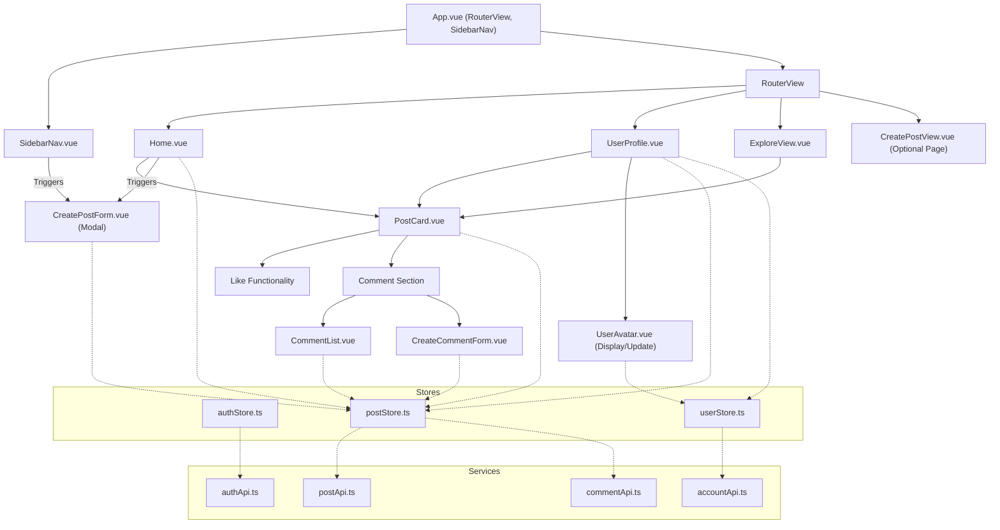

# Social Network Feature Implementation Plan

This document outlines the plan to transform the Vue project into a social network application.

**Backend API Base URL:** `https://localhost:5131/`

**Current Known Endpoints Summary:**
*   **Account Management:**
    *   `PUT /account/updateProfile`: Updates user avatar (multipart/form-data).
*   **Posts:**
    *   `POST /posts`: Creates a new post (multipart/form-data via `CreatePostRequest`).
    *   `GET /posts/{userName}`: Retrieves posts for a user.
    *   `PUT /posts/like`: Likes a post (request body: `PostId`).
*   **Comments:**
    *   `POST /comments`: Creates a comment (request body: `CreateCommentPayload`).
    *   `DELETE /comments`: Deletes a comment (request body: `CommentId`).

---

## Phase 1: Core Features with Available Endpoints

### 1. Project Setup & Navigation:
*   **Modify `App.vue`:**
    *   Integrate a persistent sidebar navigation component.
    *   The main content area will render router views.
*   **Create `SidebarNav.vue` Component:**
    *   Links: Home, My Profile (links to `/:username`), Explore, Create Post (modal trigger or dedicated page), Logout.
    *   Display current user's avatar and name (from `authStore`).
*   **Update `src/router/index.ts`:**
    *   Add route for "Explore" (e.g., `/explore` -> `ExploreView.vue`).
    *   Potentially a route for `CreatePostView.vue` if not a modal.

### 2. User Profile Enhancements:
*   **Modify `UserProfile.vue`:**
    *   **Avatar Display & Update:**
        *   Display current avatar.
        *   Button/mechanism for avatar update.
        *   Form (modal) to select an image.
        *   Call `PUT /account/updateProfile` with the image.
    *   **Posts List:** (Partially implemented)
        *   Display posts from `GET /posts/{userName}`.
    *   **(Placeholder) Follower/Following Counts & Button:**
        *   UI elements. Functionality pending backend endpoints.

### 3. Post Management:
*   **Create `PostCard.vue` Component:**
    *   Props: `post` object (`id`, `content`, `images`, `likedBy`, `createdAt`, `author`).
    *   Display content, images, author info (name, avatar, profile link), creation date.
    *   **Like Button:**
        *   Show like count.
        *   Button to like/unlike (calls `PUT /posts/like`).
        *   Indicate if current user liked.
    *   **Comment Section:**
        *   Display comment count.
        *   Link/button to view/add comments.
*   **Create `CreatePostForm.vue` Component (Modal or Page):**
    *   Input for post content (textarea).
    *   Input for image uploads (`<input type="file" multiple>`).
    *   Submit button to call `POST /posts` (content and images).
*   **Modify `Home.vue` (Initial Version):**
    *   *Interim:* Display posts from logged-in user (`GET /posts/{currentUser.username}`) or "Explore" content, pending `GET /feed`.
    *   Prominent "Create Post" button/link.
*   **Create `ExploreView.vue`:**
    *   Displays a list of posts.
    *   *Backend Question:* Source of posts (e.g., `GET /posts/all`)?

### 4. Comment Management:
*   **Create `CommentList.vue` Component:**
    *   Props: `postId`.
    *   Fetches/displays comments.
    *   *Backend Question:* Needs `GET /posts/{postId}/comments` endpoint.
    *   Each comment: author, content, timestamp.
    *   Allow deleting own comments (`DELETE /comments`).
*   **Create `CreateCommentForm.vue` Component:**
    *   Props: `postId`, `parentCommentId` (optional).
    *   Input for comment content.
    *   Submit button to call `POST /comments`.
*   **Integrate into `PostCard.vue` or `PostDetailView.vue`**.

### 5. State Management (Pinia Stores):
*   **`authStore.ts` (Extend):**
    *   Store current user's profile (avatar URL).
    *   Action to update avatar.
*   **Create `postStore.ts`:**
    *   State: `posts`, `userPosts`, `isLoading`, `error`.
    *   Actions: `fetchUserPosts`, `createPost`, `likePost`, `fetchComments`, `createComment`, `deleteComment`.
    *   *(Placeholder) `fetchFeedPosts()`.*
*   **Create `userStore.ts`:**
    *   State: User profiles, follower/following lists.
    *   Actions: `updateAvatar`.
    *   *(Placeholder) `followUser`, `unfollowUser`, `fetchFollowers`, `fetchFollowing`.*

### 6. API Services (`src/services/`):
*   **`postApi.ts`:** `createPost`, `getUserPosts`, `likePost`.
*   **`commentApi.ts`:** `createComment`, `deleteComment`, `getCommentsForPost` (awaits endpoint).
*   **`accountApi.ts` (or `userApi.ts`):** `updateUserProfile`.
    *   (Define methods for follow/unfollow, etc., when endpoints available).

---

## Phase 2: Implementing Follow Functionality & Feed (Requires Backend Endpoints)
*   Implement follow/unfollow buttons on `UserProfile.vue`.
*   Display follower/following counts.
*   Update `Home.vue` to use `GET /feed` (or equivalent).
*   Update stores and services.

---

## Diagram (High-Level Component Interaction)

---

## Outstanding API Questions & Clarifications Needed:

1.  **Get Comments for a Post:** How should the frontend fetch comments for a specific post (e.g., `GET /posts/{postId}/comments`)?
2.  **Follow/Unfollow Users:** Endpoints for following or unfollowing users.
3.  **Get Followers/Following List:** Endpoints to get a user's followers or the list of users they are following.
4.  **Home Feed (Posts from Followed Users):** An endpoint to fetch a curated feed for the logged-in user (e.g., `GET /feed` or `GET /posts/feed`).
5.  **Explore Page Content:** What posts should the "Explore" page display (e.g., all posts from all users)? Is there/will there be an endpoint for this (e.g., `GET /posts/all`)?
6.  **Unlike Post:** Is `PUT /posts/like` a toggle (like and unlike), or is a separate "unlike" endpoint needed?
7.  **`CreatePostRequest` Structure:** Clarification on the expected structure for `POST /posts`, especially how text content and image files are differentiated in the `multipart/form-data`.
8.  **`CommentId` and `PostId` Types in Requests:** For frontend requests involving `PostId` or `CommentId` in the body (e.g., `PUT /posts/like`, `DELETE /comments`), does the API expect the GUID string directly, or an object like `{ "value": "guid-string-here" }`?