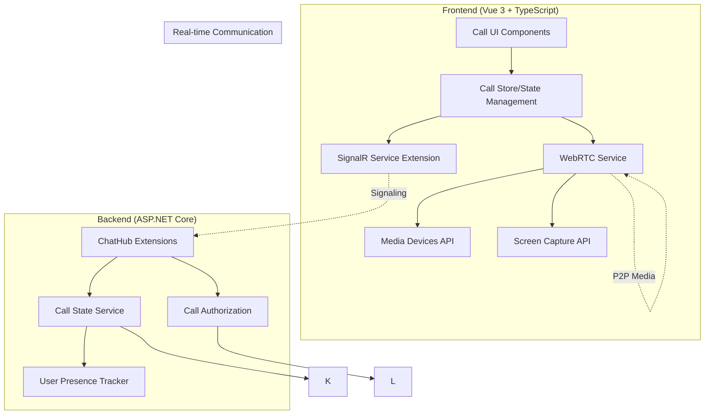
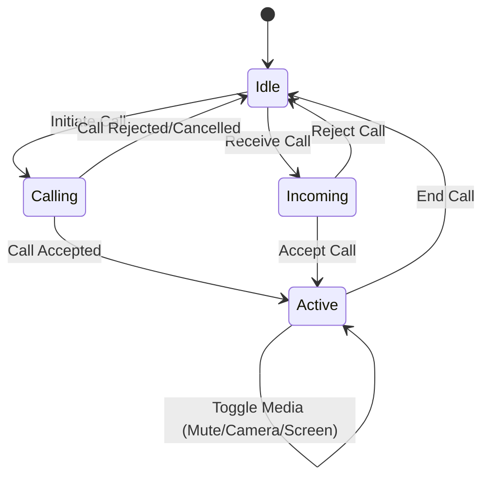

# Thrume Calling System - Architectural Plan

## Executive Summary

This document outlines the architectural design for implementing voice and video calling functionality with screen sharing in the Thrume social network application. The design leverages the existing SignalR infrastructure for signaling while using WebRTC for peer-to-peer audio/video transmission.

## 1. Architecture Overview

### 1.1 High-Level Architecture



### 1.2 WebRTC + SignalR Integration Flow

```mermaid
sequenceDiagram
    participant A as User A (Caller)
    participant SA as SignalR Hub
    participant B as User B (Callee)
    
    Note over A,B: Call Initiation
    A->>SA: InitiateCall(calleeId, callType)
    SA->>B: IncomingCall(callerId, callType, callId)
    
    Note over A,B: Call Acceptance
    B->>SA: AcceptCall(callId)
    SA->>A: CallAccepted(callId)
    
    Note over A,B: WebRTC Signaling
    A->>SA: SendOffer(callId, sdpOffer)
    SA->>B: ReceiveOffer(callId, sdpOffer)
    B->>SA: SendAnswer(callId, sdpAnswer)
    SA->>A: ReceiveAnswer(callId, sdpAnswer)
    
    Note over A,B: ICE Candidates Exchange
    A->>SA: SendIceCandidate(callId, candidate)
    SA->>B: ReceiveIceCandidate(callId, candidate)
    B->>SA: SendIceCandidate(callId, candidate)
    SA->>A: ReceiveIceCandidate(callId, candidate)
    
    Note over A,B: P2P Connection Established
    A<-.->B: Direct WebRTC Connection (Audio/Video/Screen)
    
    Note over A,B: Call Termination
    A->>SA: EndCall(callId)
    SA->>B: CallEnded(callId)
```

## 2. Technical Specifications

### 2.1 Backend Extensions

#### 2.1.1 ChatHub Extensions
```csharp
// Additional methods to add to ChatHub.cs
public async Task InitiateCallAsync(string calleeId, string callType)
public async Task AcceptCallAsync(string callId)
public async Task RejectCallAsync(string callId)
public async Task EndCallAsync(string callId)
public async Task SendOfferAsync(string callId, string sdpOffer)
public async Task SendAnswerAsync(string callId, string sdpAnswer)
public async Task SendIceCandidateAsync(string callId, string candidate)
public async Task UpdateCallStatusAsync(string callId, string status)
```

#### 2.1.2 Call State Service
```csharp
public interface ICallStateService
{
    Task<Call> CreateCallAsync(string callerId, string calleeId, CallType callType);
    Task<Call?> GetActiveCallAsync(string userId);
    Task UpdateCallStatusAsync(string callId, CallStatus status);
    Task EndCallAsync(string callId);
    Task<bool> IsUserAvailableForCallAsync(string userId);
}
```

### 2.2 Frontend Architecture

#### 2.2.1 Call Store (Pinia)
```typescript
// stores/callStore.ts
export interface CallState {
  activeCall: Call | null
  incomingCall: Call | null
  callHistory: Call[]
  localStream: MediaStream | null
  remoteStream: MediaStream | null
  isCallActive: boolean
  callStatus: CallStatus
  mediaConstraints: MediaConstraints
  callControls: CallControls
}

export interface Call {
  id: string
  callerId: string
  calleeId: string
  callType: CallType
  status: CallStatus
  startedAt: Date
  endedAt?: Date
  conversationId: string
}
```

#### 2.2.2 WebRTC Service
```typescript
// services/webrtcService.ts
export class WebRTCService {
  private peerConnection: RTCPeerConnection | null = null
  private localStream: MediaStream | null = null
  private configuration: RTCConfiguration
  
  async initializePeerConnection(): Promise<void>
  async createOffer(): Promise<RTCSessionDescriptionInit>
  async createAnswer(offer: RTCSessionDescriptionInit): Promise<RTCSessionDescriptionInit>
  async handleOffer(offer: RTCSessionDescriptionInit): Promise<void>
  async handleAnswer(answer: RTCSessionDescriptionInit): Promise<void>
  async addIceCandidate(candidate: RTCIceCandidateInit): Promise<void>
  async getUserMedia(constraints: MediaStreamConstraints): Promise<MediaStream>
  async getDisplayMedia(): Promise<MediaStream>
  async endCall(): Promise<void>
}
```

## 3. Component Architecture

### 3.1 Core UI Components

#### 3.1.1 Call Button Component
```vue
<!-- components/CallButton.vue -->
<template>
  <div class="call-controls">
    <button @click="initiateVoiceCall" class="voice-call-btn">
      <PhoneIcon />
    </button>
    <button @click="initiateVideoCall" class="video-call-btn">
      <VideoIcon />
    </button>
    <button @click="initiateScreenShare" class="screen-share-btn">
      <ScreenShareIcon />
    </button>
  </div>
</template>
```

#### 3.1.2 Incoming Call Modal
```vue
<!-- components/IncomingCallModal.vue -->
<template>
  <div v-if="incomingCall" class="incoming-call-modal">
    <div class="caller-info">
      
      <h3>{{ callerName }}</h3>
      <p>{{ callTypeText }} call</p>
    </div>
    <div class="call-actions">
      <button @click="acceptCall" class="accept-btn">Accept</button>
      <button @click="rejectCall" class="reject-btn">Reject</button>
    </div>
  </div>
</template>
```

#### 3.1.3 Active Call Interface
```vue
<!-- components/ActiveCallInterface.vue -->
<template>
  <div v-if="activeCall" class="active-call-interface">
    <div class="video-container">
      <video ref="remoteVideo" class="remote-video" autoplay playsinline></video>
      <video ref="localVideo" class="local-video" autoplay muted playsinline></video>
    </div>
    <div class="call-controls">
      <button @click="toggleMute" :class="{ active: isMuted }">
        <MicIcon v-if="!isMuted" />
        <MicOffIcon v-else />
      </button>
      <button @click="toggleCamera" :class="{ active: !isCameraOn }">
        <VideoIcon v-if="isCameraOn" />
        <VideoOffIcon v-else />
      </button>
      <button @click="toggleScreenShare" :class="{ active: isScreenSharing }">
        <ScreenShareIcon />
      </button>
      <button @click="endCall" class="end-call-btn">
        <PhoneOffIcon />
      </button>
    </div>
  </div>
</template>
```

### 3.2 Integration Points

#### 3.2.1 ConversationView Integration
```vue
<!-- Update ConversationViewEnhanced.vue -->
<template>
  <div class="conversation-view">
    <!-- Existing header -->
    <div class="header">
      <button @click="navigateToMessages" class="back-button">←</button>
      <div class="conversation-info">
        <h1>Conversation</h1>
        <!-- Add call buttons -->
        <CallButton :conversationId="conversationId" />
      </div>
    </div>
    
    <!-- Existing message container -->
    <!-- ... -->
    
    <!-- Add call interfaces -->
    <IncomingCallModal />
    <ActiveCallInterface />
  </div>
</template>
```

## 4. API Design

### 4.1 SignalR Hub Methods

#### 4.1.1 Call Management
```csharp
// Server-to-Client Events
[HubMethodName("IncomingCall")]
public async Task IncomingCall(string callId, string callerId, string callerName, string callType)

[HubMethodName("CallAccepted")]
public async Task CallAccepted(string callId)

[HubMethodName("CallRejected")]
public async Task CallRejected(string callId)

[HubMethodName("CallEnded")]
public async Task CallEnded(string callId)

// WebRTC Signaling Events
[HubMethodName("ReceiveOffer")]
public async Task ReceiveOffer(string callId, string sdpOffer)

[HubMethodName("ReceiveAnswer")]
public async Task ReceiveAnswer(string callId, string sdpAnswer)

[HubMethodName("ReceiveIceCandidate")]
public async Task ReceiveIceCandidate(string callId, string candidate)
```

#### 4.1.2 Client-to-Server Methods
```csharp
// Call Control
public async Task InitiateCallAsync(string calleeId, string callType)
public async Task AcceptCallAsync(string callId)
public async Task RejectCallAsync(string callId)
public async Task EndCallAsync(string callId)

// WebRTC Signaling
public async Task SendOfferAsync(string callId, string sdpOffer)
public async Task SendAnswerAsync(string callId, string sdpAnswer)
public async Task SendIceCandidateAsync(string callId, string candidate)
```

### 4.2 REST API Extensions

```csharp
// Controllers/CallController.cs
[ApiController]
[Route("api/[controller]")]
public class CallController : ControllerBase
{
    [HttpGet("history")]
    public async Task<IActionResult> GetCallHistory()
    
    [HttpGet("active")]
    public async Task<IActionResult> GetActiveCall()
    
    [HttpPost("permissions")]
    public async Task<IActionResult> UpdateCallPermissions([FromBody] CallPermissions permissions)
}
```

## 5. Security and Privacy

### 5.1 Permission Management
```typescript
// services/permissionService.ts
export class PermissionService {
  async requestCameraPermission(): Promise<boolean>
  async requestMicrophonePermission(): Promise<boolean>
  async requestScreenSharePermission(): Promise<boolean>
  async checkPermissions(): Promise<MediaPermissions>
}
```

### 5.2 Call Authorization
```csharp
// Backend authorization checks
public async Task<bool> CanUserCallAsync(string callerId, string calleeId)
{
    // Check if users are in same conversation
    // Check if callee has blocked caller
    // Check if callee allows calls from this user
    // Check if callee is currently available
}
```

## 6. State Management

### 6.1 Call State Flow



### 6.2 Frontend State Management
```typescript
// stores/callStore.ts
export const useCallStore = defineStore('call', {
  state: (): CallState => ({
    activeCall: null,
    incomingCall: null,
    callHistory: [],
    localStream: null,
    remoteStream: null,
    isCallActive: false,
    callStatus: CallStatus.Idle,
    mediaConstraints: defaultMediaConstraints,
    callControls: defaultCallControls
  }),
  
  actions: {
    async initiateCall(calleeId: string, callType: CallType),
    async acceptCall(callId: string),
    async rejectCall(callId: string),
    async endCall(callId: string),
    async toggleMute(),
    async toggleCamera(),
    async toggleScreenShare()
  }
})
```

## 7. Implementation Phases

### Phase 1: Core Infrastructure (Week 1-2)
1. Extend ChatHub with call signaling methods
3. Implement CallStateService
4. Create basic WebRTC service
5. Add call-related SignalR events to frontend

### Phase 2: Basic Voice Calls (Week 3-4)
1. Implement voice call initiation
2. Create incoming call modal
3. Build active call interface for voice
4. Add call controls (mute, end call)
5. Implement call state management

### Phase 3: Video Calls (Week 5)
1. Add video stream handling
2. Implement camera controls
3. Create video call UI components
4. Add video-specific call controls

### Phase 4: Screen Sharing (Week 6)
1. Implement screen capture API integration
2. Add screen sharing controls
3. Handle screen share in active call interface
4. Add screen share signaling

### Phase 5: Polish & Testing (Week 7)
1. Error handling and edge cases
2. UI/UX improvements
3. Performance optimization
4. Cross-browser testing

## 8. Technical Considerations

### 8.1 WebRTC Configuration
```typescript
const rtcConfiguration: RTCConfiguration = {
  iceServers: [
    { urls: 'stun:stun.l.google.com:19302' },
    { urls: 'stun:stun1.l.google.com:19302' }
    // Add TURN servers for production
  ],
  iceCandidatePoolSize: 10
}
```

### 8.2 Media Constraints
```typescript
const defaultVideoConstraints: MediaStreamConstraints = {
  video: {
    width: { ideal: 1280 },
    height: { ideal: 720 },
    frameRate: { ideal: 30 }
  },
  audio: {
    echoCancellation: true,
    noiseSuppression: true,
    autoGainControl: true
  }
}
```

### 8.3 Error Handling
```typescript
export enum CallError {
  PERMISSION_DENIED = 'PERMISSION_DENIED',
  USER_BUSY = 'USER_BUSY',
  NETWORK_ERROR = 'NETWORK_ERROR',
  WEBRTC_ERROR = 'WEBRTC_ERROR',
  SIGNALING_ERROR = 'SIGNALING_ERROR'
}
```

## 9. Dependencies and Requirements

### 9.1 New Dependencies
```json
{
  "dependencies": {
    // No additional dependencies needed for basic WebRTC
  }
}
```

### 9.2 Browser Support
- Chrome 80+
- Firefox 75+
- Safari 14+
- Edge 80+

### 9.3 Infrastructure Requirements
- HTTPS required for WebRTC
- STUN/TURN servers for production
- Firewall configuration for UDP traffic

## 10. Future Enhancements

### 10.1 Advanced Features
- Group calls support
- Call recording
- Call quality indicators
- Bandwidth adaptation
- Mobile app support

### 10.2 Scalability Considerations
- TURN server infrastructure
- Load balancing for SignalR hubs
- Call analytics and monitoring
- CDN for media streaming

---

This architectural plan provides a comprehensive roadmap for implementing voice, video calls, and screen sharing functionality in the Thrume social network application while leveraging the existing SignalR infrastructure for optimal integration and performance.

## File Structure Overview

```
backend/
├── Thrume.Api/
│   ├── Hubs/
│   │   └── ChatHub.cs (extended)
│   └── Controllers/
│       └── CallController.cs (new)
├── Thrume.Domain/
│   └── Entity/
│       └── Call.cs (new)
└── Thrume.Services/
    ├── ICallStateService.cs (new)
    └── CallStateService.cs (new)

frontend/
├── src/
│   ├── components/
│   │   ├── CallButton.vue (new)
│   │   ├── IncomingCallModal.vue (new)
│   │   └── ActiveCallInterface.vue (new)
│   ├── services/
│   │   ├── webrtcService.ts (new)
│   │   └── permissionService.ts (new)
│   ├── stores/
│   │   └── callStore.ts (new)
│   └── types/
│       └── call.ts (new)
```

This comprehensive plan provides everything needed to implement a robust calling system that integrates seamlessly with the existing Thrume messaging infrastructure.