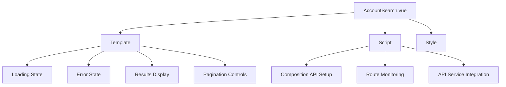

# AccountSearch Component Design Specification

## Overview
This document outlines the design and implementation plan for the AccountSearch Vue 3 component that handles the `/search/:name` route. The component will display user search results with pagination, loading states, and error handling.

## Requirements
1. Fetch data from `GET /account/search/{userName}`
2. Pass `page` and `pageSize` as query parameters
3. Display results showing `userName` and `pictureUrl`
4. Implement loading indicators during API calls
5. Handle error states for failed API requests
6. Ensure reactive updates when route parameter changes
7. Define TypeScript interfaces for response data
8. Use Vue 3 Composition API patterns

## Component Structure


## TypeScript Interfaces
```typescript
// In accountService.ts
export interface SearchResult {
  userName: string;
  pictureUrl: string;
  // Other fields as needed
}

export interface SearchResponse {
  results: SearchResult[];
  total: number;
  page: number;
  pageSize: number;
}
```

## API Service Implementation
```typescript
// Add to accountService.ts
async searchUsers(
  userName: string, 
  page: number = 1, 
  pageSize: number = 10
): Promise<SearchResponse> {
  try {
    const response = await apiClient.get(`/account/search/${userName}`, {
      params: { page, pageSize }
    });
    return response.data;
  } catch (error) {
    console.error('Error searching users:', error);
    throw error;
  }
}
```

## Component Template
```vue
<template>
  <div class="account-search">
    <h1>Search Results for "{{ route.params.name }}"</h1>
    
    <div v-if="loading" class="loading-indicator">
      <spinner-component /> <!-- Use existing spinner if available -->
    </div>
    
    <div v-if="error" class="error-message">
      Error: {{ error.message }}
    </div>
    
    <div v-if="results" class="results-container">
      <div v-for="user in results" :key="user.userName" class="user-card">
        
        <span>{{ user.userName }}</span>
      </div>
    </div>
    
    <pagination-controls 
      v-if="total > 0"
      :current-page="page"
      :total-items="total"
      :page-size="pageSize"
      @page-change="handlePageChange"
    />
  </div>
</template>
```

## Script Implementation (Composition API)
```typescript
<script lang="ts">
import { defineComponent, ref, watch, onMounted } from 'vue';
import { useRoute } from 'vue-router';
import accountService, { SearchResult, SearchResponse } from '../services/accountService';

export default defineComponent({
  name: 'AccountSearch',
  setup() {
    const route = useRoute();
    const loading = ref(false);
    const error = ref<Error | null>(null);
    const results = ref<SearchResult[]>([]);
    const total = ref(0);
    const page = ref(1);
    const pageSize = ref(10);

    const fetchData = async () => {
      loading.value = true;
      error.value = null;
      try {
        const response = await accountService.searchUsers(
          route.params.name as string,
          page.value,
          pageSize.value
        );
        results.value = response.results;
        total.value = response.total;
      } catch (err) {
        error.value = err as Error;
      } finally {
        loading.value = false;
      }
    };

    onMounted(fetchData);

    // React to route parameter changes
    watch(() => route.params.name, (newName, oldName) => {
      if (newName !== oldName) {
        page.value = 1;
        fetchData();
      }
    });

    const handlePageChange = (newPage: number) => {
      page.value = newPage;
      fetchData();
    };

    return { 
      loading,
      error,
      results,
      total,
      page,
      pageSize,
      route,
      handlePageChange
    };
  }
});
</script>
```

## Error Handling Strategy
- Global error handling via axios interceptors
- Local component error state with user-friendly messages
- Console logging for debugging
- Error boundaries (optional enhancement)

## Loading Indicators
- Spinner component during API calls
- Skeleton loaders for results (optional enhancement)

## Reactivity Implementation
- Watch route parameter changes using Vue's `watch`
- Reset pagination to first page when search term changes
- Fetch new data on page change events

## Next Steps
1. Implement the search method in `accountService.ts`
2. Create the AccountSearch.vue component
3. Add pagination controls component if not available
4. Test component with various search scenarios